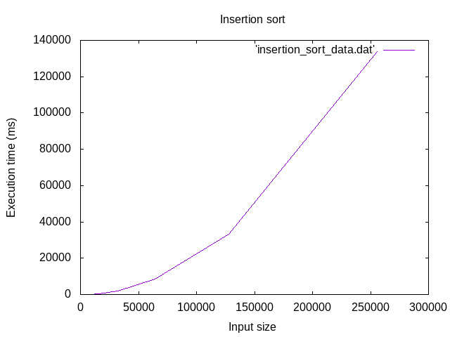

# Searching and sorting time

This directory contains programs that measure searching and sorting times
and prove experimentally some concepts. 

## Binary search

The file [bstime.C](bstime.C) contains a program that performs an experimental
proof of the execution time of the
[binary search algorithm](https://en.wikipedia.org/wiki/Binary_search_algorithm).

### The experiment

The experiment consists of creating an array with N elements, starting with
N = 2^10. This sequence is built sorted from with numbers from 0 to N-1. Then
is executed the search method to search the value N (failed search, in other
words, the worst case). The array size is duplicated 19 times to get the data
to be plotted for 20 executions. Each experiment is executed 20 times to get
the average execution time.

Each experiment is executed 20 times to get the average execution time.

### Output

This programs generates two files: bs_data.dat with the data to plot the size of
the array vs the execution time, and bs_plot.gp with the instructions to generate
a graphic with [gnuplot](http://www.gnuplot.info/).

### Usage

Compiling the program:

```bash
$ make bstime
```

Excecuting the program:

```bash
$ ./bstime
```

Generating the graphic:

```bash
$ gnuplot bs_plot.gp
$ eog bs_graphic.png
```


## Insertion sort

The file [insertionsorttime.C](insertionsorttime.C) contains a program that
performs an experimental proof of the execution time of the
[insertion sort algorithm](https://en.wikipedia.org/wiki/Insertion_sort).

### The experiment

The experiment consists of creating an array with N elements, starting with
N = 2^9. This sequence is built unsorted or sorted depending on the execution.
Then is executed the sort method. The array size is duplicated 9 times to get
the data to be plotted for 10 executions.

### Output

This programs generates two files: insertion_sort_data.dat with the data to plot
the size of the array vs the execution time, and insertion_sort_plot.gp with
the instructions to generate a graphic with [gnuplot](http://www.gnuplot.info/).

### Usage

Compiling the program:

```bash
$ make insertionsorttime
```

Excecuting the program:

```bash
$ ./insertionsorttime
```

Generating the graphic:

```bash
$ gnuplot insertion_sort_plot.gp
$ eog insertion_sort_graphic.png
```


